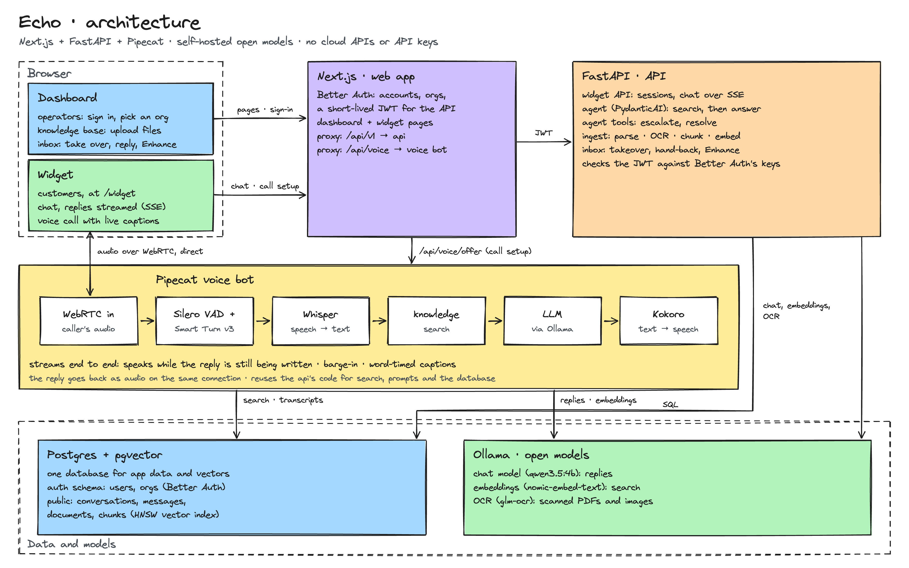

# Echo

AI customer support you can embed on a website: a chat and voice widget,
answered by an AI agent that searches the business's knowledge base and hands
off to a human operator when needed. Everything runs locally on one Mac: no
cloud APIs, no API keys.

A local-only rebuild of a Next.js + Convex + Clerk + Vapi + OpenAI SaaS
template:

| Part | What | Replaces |
|---|---|---|
| `web/` | Next.js 16 + shadcn/ui: the dashboard and the `/widget` page | two Next.js apps |
| `api/` | FastAPI (Python 3.13), PydanticAI agents, SQLAlchemy | Convex |
| Postgres + pgvector | data and vector search | Convex DB + vector search |
| Ollama | `qwen3.5:4b` replies, `nomic-embed-text` search, `glm-ocr` OCR | OpenAI |
| Better Auth | accounts and organizations in Next.js; FastAPI checks its JWTs | Clerk |
| `voice/` | Pipecat: Silero VAD, Smart Turn v3, Whisper and Kokoro on MLX | Vapi |



## Features

- **Widget** for customers: chat with streamed replies, or a voice call with
  live captions; grounded in the knowledge base; asks for a person on request.
- **Knowledge base**: upload PDF, Word, Markdown, text, HTML, and scanned
  PDFs or images (OCR); searched on every question.
- **Inbox** for operators: every conversation (chats and call transcripts),
  take over from the AI, hand back, resolve, and an "Enhance" rewrite of a
  reply draft.
- **Organizations**: each business has its own knowledge base, conversations
  and widget.

## Requirements

- A Mac with Apple Silicon (the voice bot runs Whisper and Kokoro on the GPU
  with MLX) and ~16 GB of memory
- Python 3.13 with [uv](https://docs.astral.sh/uv/), Node.js 22+ with pnpm, `psql`
- Postgres 17 with pgvector, for example:

  ```bash
  docker run -d --name echo-db -p 5432:5432 -e POSTGRES_USER=echo \
    -e POSTGRES_PASSWORD=echo -e POSTGRES_DB=echo pgvector/pgvector:pg17
  ```

- [Ollama](https://ollama.com) with the models:

  ```bash
  ollama pull qwen3.5:4b && ollama pull nomic-embed-text
  ollama pull glm-ocr:q8_0   # optional: scanned PDFs and images
  ```

## Getting started

```bash
cp .env.example .env   # set BETTER_AUTH_SECRET: openssl rand -base64 32
make setup             # dependencies, database tables, voice models (~800 MB)
make dev               # web :3000, api :8000, voice bot :8001
make seed              # in another terminal: demo login + sample knowledge base
```

Open http://localhost:3000 and sign in as `demo@example.com` /
`echo-demo-password`. The dashboard links to the organization's widget. Use
`localhost` (or HTTPS): browsers only allow the microphone there.

| Command | |
|---|---|
| `make test` | API and voice tests (a real Postgres; the models are faked) |
| `make check` | ruff, ESLint, TypeScript |
| `make migrate` | apply new database migrations |
| `make eval ORG=<id>` | does the chat stay grounded? (real model) |
| `make voice-eval ORG=<id>` | voice answers vs knowledge-base passages |
| `make voice-latency ORG=<id>` | a scripted voice call, timed as the caller hears it |

`make seed` prints the demo organization's id for the last three.

## How it works

### Chat

- Widget visitors have no account: a name and email give them a **contact
  session** (`api/src/echo_api/contacts.py`), sent as `X-Contact-Session`.
  They only ever see their own conversations.
- Replies stream as **Server-Sent Events**. Next.js proxies `/api/v1` to
  FastAPI and would gzip (and so buffer) the stream, hence
  `Cache-Control: no-transform`.
- **The agent** (`agent.py`) searches the knowledge base *before* every reply
  and puts the results after the question, with a reminder to answer only
  from them. A 4B model given a search *tool* skipped it and made answers up.
  Its tools escalate (only when the customer asks for a person) or resolve
  the conversation.
- The prompt keeps a fixed start (instructions, history) so Ollama can reuse
  its cache, and thinking is turned off: seconds of hidden reasoning per
  reply otherwise.

### Knowledge base

- `markitdown` turns a file into Markdown. Scans and images go through
  GLM-OCR (`ocr.py`), which repeats itself endlessly: the output is streamed
  and cut at the first repeated paragraph.
- Chunks follow the document's sections (~1,000 characters, each starting
  with its heading trail), embedded with `nomic-embed-text` into pgvector
  (HNSW index). Search stays within the organization and drops anything past
  cosine distance 0.45.

### Operator inbox

- Keyset pagination on `(updated_at, id)`; the inbox, open threads and the
  widget poll for changes.
- An operator's reply takes the conversation over and the AI goes quiet.
- "Enhance" is a second agent whose output validator rejects rewrites that
  add numbers or currency symbols (the model turned "499" into "$499").

### Voice

The widget calls the Pipecat bot in `voice/` over WebRTC; only the call setup
goes through Next.js.

```
mic → Silero VAD + Smart Turn v3 → Whisper (MLX) → knowledge search
    → qwen3.5:4b (Ollama) → Kokoro (MLX) → speaker
```

- Replies start ~3–4.5 s after the caller stops. `make voice-latency` breaks
  each wait down:

  ```
  WAIT 3.52 s = turn end 1.09 + search 0.03 + first token 1.35
                + chunk written 0.32 + Kokoro + audio 0.74
  ```

- While the greeting plays, the bot loads the models and has Ollama read the
  instructions, so the first question only costs its own tokens.
- A turn ends once *every* part of it is transcribed ("Sorry, one more
  thing. When is…" is two stretches of speech).
- Kokoro speaks a whole piece of text at a time, so the start of a reply is
  cut at commas. It runs on the GPU through mlx-audio with espeak phonemes;
  MLX's buffer cache is capped at 256 MB (uncapped, it reached 7 GB).
- Word timings are estimated from each word's phonemes: the widget shows
  live captions, and an interrupted answer is saved up to the words heard.
- Two knowledge-base passages per spoken answer (four in chat): each one is
  ~0.26 s of reading before the first word, with no loss in `make voice-eval`.

### Auth

- Better Auth (`web/lib/auth.ts`) runs in Next.js, with its tables in the
  `auth` schema. For API calls the browser gets a 15-minute JWT (Ed25519)
  carrying the user and the active organization.
- FastAPI (`api/src/echo_api/auth.py`) verifies it against Better Auth's
  public keys (algorithm pinned, issuer, audience, expiry), and every query
  is filtered by the organization.

## Project layout

```
web/     Next.js: dashboard, widget, Better Auth
api/     FastAPI: widget API, agents, knowledge base, inbox (echo_api)
voice/   Pipecat voice bot; reuses echo_api for search and the database
docs/    architecture diagram, sample knowledge base (used by make seed)
```

## Notes

- Not included: widget customization, an embed script for other sites,
  pushed (instead of polled) updates, billing.
- Python 3.13 (not 3.14) for the voice dependencies; TypeScript 6 and ESLint 9
  because typescript-eslint and eslint-plugin-react don't support 7 and 10 yet.

## License

[MIT](LICENSE)
