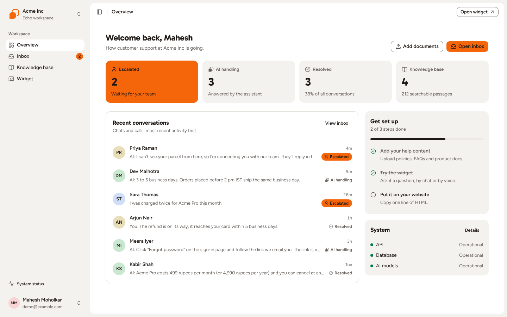
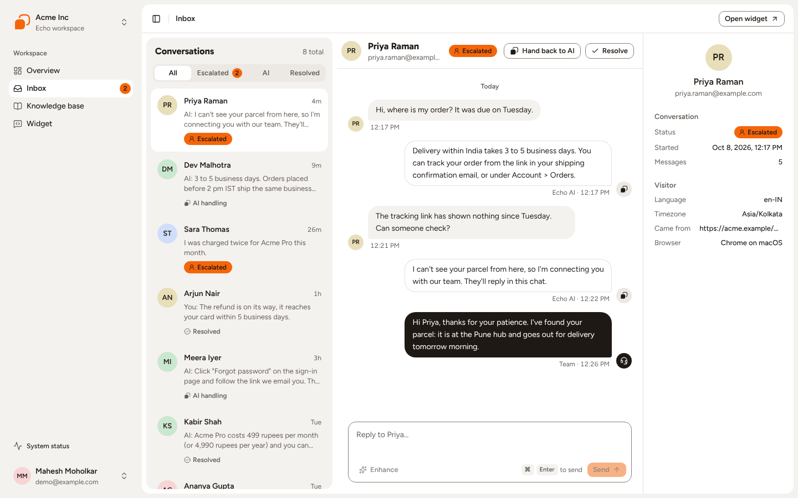
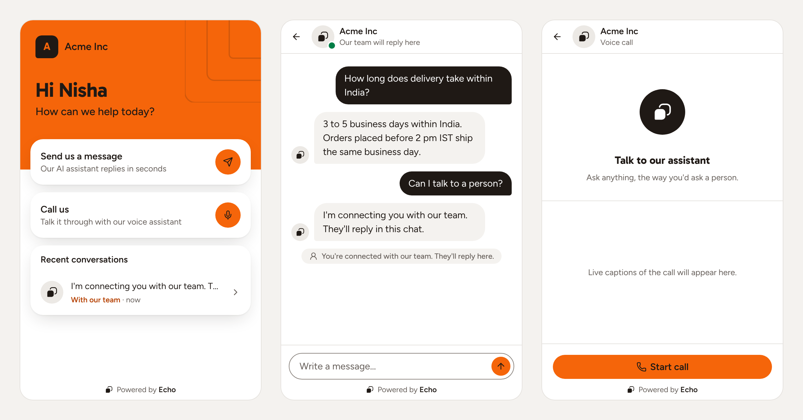
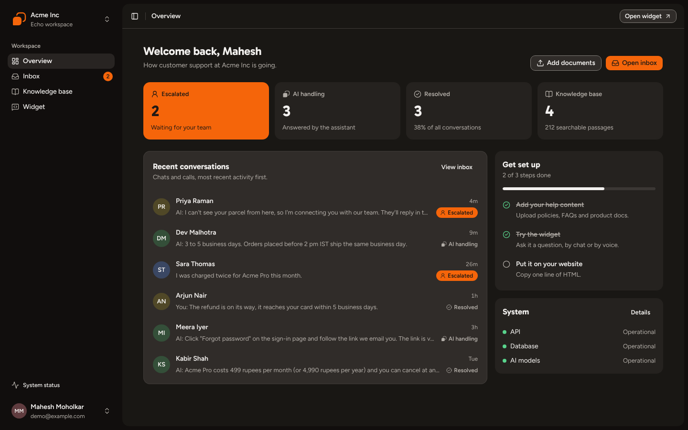
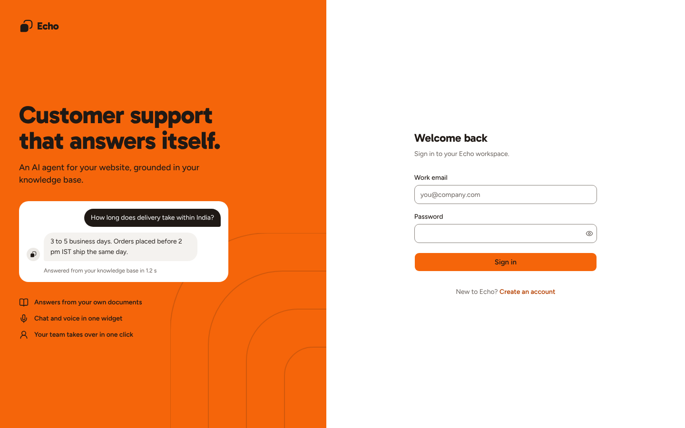

# Echo's interface

How the dashboard and the widget are meant to look, and where the pieces live.
The tokens are in `web/app/globals.css`; this page is how to use them.

The screenshots use sample data.

## One rule: orange means it is your turn

A support desk is calm while the AI is answering. So the product is ink on
white with soft grey trays, and orange (`primary`) appears only where a person
has to act:

- an **Escalated** conversation: its status tag, the Escalated tile on
  Overview, the count beside Inbox;
- the **one main button** of a screen: Open inbox, Upload, Send, Sign in,
  Continue, Start call;
- the customer's invitations in the widget: the discs on "Send us a message"
  and "Call us", and the rings around the orb while they speak.

Orange is also the brand, so it fills the two surfaces that ask someone to
begin (the widget's greeting and the sign-in panel) and the logo. That is the
whole list. What follows from it:

- Echo the assistant is never orange. Draw it in ink: `EchoGlyph`,
  `EchoAvatar`, "AI handling" in `text-muted-foreground`.
- Only Escalated has a fill. "AI handling" and "Resolved" are a mark and a
  word.
- Text on orange is ink (`text-primary-foreground`), in both themes.
- One orange button per screen. A second action is `variant="outline"`.

## Color

| Use | Classes |
|---|---|
| The sheet: the page you work on | `bg-background`, `bg-card` for things lifted off a tray |
| The desk: the ground under the sheet, the sidebar | `bg-sidebar` |
| A tray: a soft fill that groups things | `bg-muted`; `bg-secondary` and `bg-accent` for tracks and hover |
| Text | `text-foreground`, `text-muted-foreground` |
| Orange as a fill, with ink on it | `bg-primary text-primary-foreground` |
| Orange as words on a light surface | `text-primary-text` |
| Something waiting on a person, as a tint | `bg-primary-soft` |
| Working, ready, online: a dot or a tick beside a word | `bg-success`, `text-success` |
| Errors | `text-destructive`, `bg-destructive-soft`; `bg-destructive-solid` only for End call and the final Delete |
| The edge of fields and outline buttons (3:1) | `border-input` |
| Hairlines | `border-border` |
| Avatar tints | `bg-avatar-1` to `bg-avatar-6`, picked by `avatarTint(name)` |

No gradients, no glass, no tinted icon squares, no Tailwind palette colors
(`amber-500` and friends): if a color is not in the table, the design does not
use it. Light and Dark carry the same roles; in Dark, lifted things get
lighter.

## Type

- **Gabarito** for headings, greetings and the numbers that matter. Use the
  utilities: `title-hero`, `title-greeting`, `title-stat`, `title-page`,
  `title-section`. They are named `title-*` so `cn()` never mistakes one for a
  text color.
- **Figtree** for everything else. `text-sm` (14/22) is the interface size;
  `text-[13px]/4.5` for previews and descriptions; `text-xs` for status tags,
  counts and timestamps; `text-[15px]/5.5` for bubbles in the widget.
- **Geist Mono** (`font-mono`) for things you copy: the embed snippet, the
  direct link, token claims.
- Names are `font-semibold`. Sentence case everywhere; no uppercase labels.

## Shape

- **The bubble corner.** Anything that speaks is `rounded-xl` with one tight
  corner pointing at the speaker: `rounded-bl-tail` for a message coming in,
  `rounded-br-tail` for one going out. The logo, the organization badge in the
  widget and the icon tile of an empty state have the same corner.
- **The echo.** The outline of a shape, one step out: the open outline behind
  the logo's bubble, the focus ring (2px ink, 2px off, on every control), the
  rings that leave the orb during a call, and the large outlines on the two
  orange surfaces (`Echoes`).
- Radii: `rounded-md` controls, `rounded-lg` trays and sheets, `rounded-xl`
  bubbles, dialogs and the widget's cards, `rounded-full` avatars, status tags
  and call buttons.
- Fills separate things, not shadows. Only what floats casts one:
  `shadow-overlay` for menus, toasts and the widget's cards where they ride
  over the greeting, `shadow-dialog` for dialogs.

## Where things live

| Thing | File |
|---|---|
| Tokens, the focus ring, the `title-*` utilities | `web/app/globals.css` |
| `LogoMark`, `EchoGlyph`, `Logo`, `Echoes` | `web/components/logo.tsx` |
| `StatusBadge`, `CountBadge`, `Dot` | `web/components/status.tsx` |
| `UserAvatar`, `EchoAvatar`, `TeamAvatar` | `web/components/user-avatar.tsx` |
| `Bubble`, `Typing`, `Notice`, `Caret` | `web/components/bubble.tsx` |
| `Card` (`variant="outline"` or `"tray"`), `Button`, the rest of the primitives | `web/components/ui/` |

A bubble has a side and a tone. `tray` is the other side of the conversation,
`line` is Echo answering on your behalf, `ink` is a person on this side. So in
the dashboard the customer comes in on a tray, Echo goes out on an outlined
sheet and the team goes out in ink; in the widget the customer goes out in ink,
and Echo and the team both come in on a tray.

## Words

- Buttons are verbs and keep their name through a flow: **Delete** in the
  dialog titled "Delete acme-warranty.pdf?".
- Operators see "Escalated", "AI handling", "Resolved". Customers see "With
  our team", "Open", "Closed".
- In the widget the business is "we" and "us".
- Empty states say what will show up and what makes it: "When customers message
  your widget, they show up here."
- No emoji, no exclamation marks.
